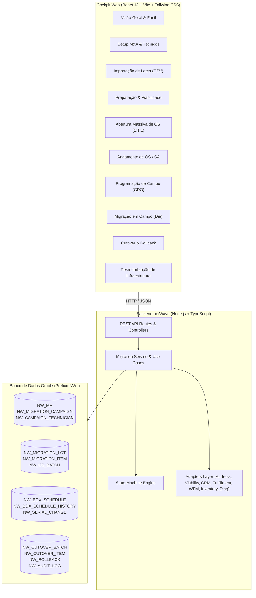

# V.tal netWave — Orquestração de Migração Física M&A

Plataforma corporativa da V.tal destinada à **orquestração e execução da migração física em massa de clientes adquiridos via operações de M&A** (ISPs regionais) para a infraestrutura de fibra óptica neutra da V.tal.

---

## 1. Visão Geral e Contexto de Negócio

Nas operações de M&A, a V.tal/Nio adquire principalmente:
* Clientes;
* ONTs instaladas nas residências;
* Cabos drop.

A infraestrutura restante (estações, rotas de backbone, cabos de distribuição, caixas de emenda e CDOs de origem) permanece de propriedade da operadora adquirida e passa a ser alugada temporariamente.

O objetivo do **netWave** é acelerar a **migração física do acesso** para a rede neutra V.tal, eliminando progressivamente a dependência e o custo recorrente de aluguel da infraestrutura legada.

### Premissas Fundamentais de Negócio
1. **Cliente Já Migrado Comercialmente:** O cliente já está cadastrado no CRM Nio (Salesforce) e faturado pela Nio. O netWave atua estritamente na migração física de rede.
2. **Regra Mandatória 1:1:1:**
   $$\text{1 Cliente} = \text{1 OS Individual} = \text{1 SA Individual}$$
   Comandos massivos (ex.: 1.000 clientes ou por CDO) disparam ordens estritamente individuais com status, retentativa e auditoria próprios.
3. **Reaproveitamento da ONT e Rastreabilidade Dupla:** A ONT existente é reutilizada sem troca física desnecessária. Mantém-se separadamente `ontSerialOriginal` (importado no lote) e `ontSerialEffective` (confirmado/corrigido em campo).
4. **Pool Segregado e Técnico Buffer:** Técnicos de campanha pertencem ao pool `MIGRATION_CAMPAIGN` e não concorrem com a força de trabalho BAU. Ao ser gerado, o SA é associado a um técnico virtual `BUFFER / PARKING LOT` para impedir despacho automático precoce.
5. **Planejamento Centrado na CDO/CDOI:** A caixa (8 a 16 clientes) é a unidade operacional primária para agendamento de rotas de campo.
6. **Cutover Individualizado e Resiliente:** Disparado por CDO, mas processado cliente a cliente. Em caso de falha de 1 cliente em 8, os 7 migrados são confirmados (`MIGRATED`) e a retentativa atua unicamente sobre a falha.

---

## 2. Diagrama Arquitetural da Solução



---

## 3. Estrutura do Repositório

```
netwave/
├── package.json               # Dependências e scripts de execução
├── tsconfig.json              # Configurações TypeScript NodeNext
├── start-dev.ps1              # Launcher de desenvolvimento local PowerShell
├── migrations/oracle/         # Scripts DDL versionados com prefixo NW_
│   ├── 001-baseline-nw-tables.sql
│   └── 002-nw-indexes-and-constraints.sql
├── docs/                      # Documentações, tokens e design system corporativo V.tal
│   ├── 3-system-design/
│   └── 4-design-system/
├── src/
│   ├── index.ts               # Ponto de entrada do servidor backend (porta 4001)
│   ├── server.ts              # Roteador HTTP REST nativo
│   ├── modules/
│   │   └── migration-service.ts # Orquestrador com regras de negócio e use cases
│   └── shared/
│       ├── domain/            # Tipos, Enums e Máquina de Estados formal
│       ├── persistence/       # DatabaseClient, Repositório Oracle e In-Memory
│       ├── adapters/          # Interfaces e implementações dos serviços externos
│       └── logging/           # Logger estruturado JSON
├── web/                       # Frontend React + Vite
│   ├── index.html
│   ├── src/
│   │   ├── main.tsx & App.tsx
│   │   ├── index.css          # Design tokens V.tal e hairline bar superior
│   │   ├── components/        # Layout, Header, Sidebar e UI Primitives
│   │   ├── pages/             # As 10 telas operacionais do Cockpit
│   │   └── services/          # API Client Axios
└── test/
    └── scenarios/             # Suíte com os 6 casos operacionais mandatórios
```

---

## 4. Variáveis de Ambiente (`.env`)

Crie o arquivo `.env` na raiz do projeto conforme o modelo abaixo:

```ini
# Configurações Gerais
NODE_ENV=development
PORT=4001
VITE_PORT=5200
APP_NAME=v-tal-netwave
LOG_LEVEL=info

# Banco de Dados Oracle (Instância de Dev)
# Todas as tabelas criadas no banco compartilhado utilizam obrigatoriamente o prefixo NW_
DATABASE_PROVIDER=in-memory   # ou 'oracle' para persistência direta
ORACLE_CONNECTION_STRING=oraculod-h1:1549/oraculod
ORACLE_USER=ORACULOD
ORACLE_PASSWORD=VCG2_4GDkpPusIv9amgwp
ORACLE_OBJECT_PREFIX=NW_
ORACLE_POOL_MIN=1
ORACLE_POOL_MAX=5
ORACLE_POOL_TIMEOUT_SECONDS=30
ORACLE_POOL_PING_INTERVAL_SECONDS=30

# Oracle Instant Client
NETWIN_ORACLE_CLIENT_LIB_DIR=C:\Users\VT158145\workspace\nexus\.tools\oracle-instantclient-21.22\instantclient_21_22
```

---

## 5. Instruções para Execução Local

### Pré-requisitos
* Node.js 22+ instalado
* PowerShell (ambiente Windows)

### Execução dos Testes Automatizados
Para rodar a suíte completa que valida os 6 cenários mandatórios de negócio:

```bash
npx vitest run
```

### Inicialização da Aplicação Completa (Fullstack)
Para iniciar o backend (`http://localhost:4001`) e o frontend Vite (`http://localhost:5200`):

```powershell
.\start-dev.ps1
```

Para inicializar já carregando uma base de demonstração (M&A Fibrasul, Campanha Niterói, técnicos e 8 clientes na CDO-RJ-1048):

```powershell
.\start-dev.ps1 -Seed
```

---

## 6. Catálogo de APIs e Exemplos de Payload

### 6.1 Cadastro de Operação M&A
* **POST** `/api/v1/migration/ma`
```json
{
  "name": "M&A Fibrasul RJ",
  "originProvider": "Fibrasul Telecom Ltda",
  "startDate": "2026-09-01",
  "uf": "RJ",
  "description": "Aquisição das bases de Niterói e São Gonçalo"
}
```

### 6.2 Cadastro de Campanha com Técnico Buffer
* **POST** `/api/v1/migration/campaigns`
```json
{
  "maId": "MA-B077B8D6",
  "name": "Campanha Niterói Centro 2026",
  "bufferTechnicianId": "BUFFER_MIG_FIBRASUL",
  "bufferTechnicianName": "Fila Buffer Migração Fibrasul"
}
```

### 6.3 Importação de Lote de Clientes
* **POST** `/api/v1/migration/lots/upload`
```json
{
  "campaignId": "CAMP-498C7A01",
  "fileName": "lote_icarai.csv",
  "actor": "OPERADOR_EXPEDICAO",
  "rows": [
    {
      "externalCustomerId": "CUST-RJ-901",
      "customerName": "Maria Aparecida Silva",
      "rawAddress": "Rua Coronel Moreira Cesar, 102",
      "cep": "24230-050",
      "city": "Niterói",
      "state": "RJ",
      "ontSerial": "ALCLB440192",
      "originProvider": "Fibrasul",
      "originBoxId": "CDO-FIBRASUL-01"
    }
  ]
}
```

### 6.4 Abertura Massiva de OS (1 Cliente = 1 OS = 1 SA)
* **POST** `/api/v1/migration/os/batches`
```json
{
  "campaignId": "CAMP-498C7A01",
  "itemIds": ["MIG-01920D4A-1", "MIG-01920D4A-2"],
  "actor": "OPERADOR_ORDENS"
}
```

### 6.5 Programação de Campo por CDO
* **POST** `/api/v1/migration/box-schedules`
```json
{
  "campaignId": "CAMP-498C7A01",
  "targetBoxId": "CDO-RJ-1048",
  "scheduledDate": "2026-09-23",
  "technicianId": "TECH-CARLOS-MENDES"
}
```

### 6.6 Correção de Serial em Campo
* **PATCH** `/api/v1/migration/items/{id}/serial`
```json
{
  "newSerial": "ALCLB998877",
  "reason": "PREVIOUS_ONT_REPLACEMENT",
  "observation": "Cliente informou substituição anterior de equipamento pelo ISP regional"
}
```

### 6.7 Disparo de Cutover
* **POST** `/api/v1/migration/cutovers`
```json
{
  "campaignId": "CAMP-498C7A01",
  "targetBoxId": "CDO-RJ-1048"
}
```

### 6.8 Rollback Formal
* **POST** `/api/v1/migration/items/{id}/rollback`
```json
{
  "reason": "Atenuação óptica persistente (-38 dBm) no canal GPON da CDO V.tal"
}
```

---

## 7. Decisões Arquiteturais Adotadas

1. **Separação Estrita de Projetos:** O repositório `netwave` vive de forma autônoma sem acoplamento direto ou alteração em tempo de execução com o repositório `nexus`.
2. **Design Tokens e Identidade Visual V.tal:** Incorporação completa do sistema de design da V.tal (cores da marca, hairline amarelo superior, badges com saturação controlada, tipografia Inter e Montserrat).
3. **Abstração Dupla de Banco de Dados:** Suporte nativo ao driver oficial `oracledb` com prefixo obrigatório `NW_` e implementação transparente `in-memory` para execução de testes unitários ultrarrápidos e operação offline sem dependência de VPN corporativa.
4. **Resiliência e Idempotência:** Cada cliente na jornada de cutover transita de forma independente. Uma transação nunca engloba clientes múltiplos, garantindo que falhas ópticas ou de provisionamento fiquem isoladas.
5. **Auditoria Estrita:** Todas as operações críticas (abertura massiva, programação, reprogramação de data/técnico, alteração de serial de ONT e rollback) geram eventos imutáveis com `CORRELATION_ID`, `ACTOR`, `BEFORE_STATE` e `AFTER_STATE`.

---

## 8. Limitações Conhecidas & Próximos Passos

* **Substituição dos Adapters Stubs por Endpoints Reais:** Os serviços `SalesforceOrderService`, `FulfillmentService` e `DiagnosticsService` estão com implementações padrão configuráveis (`Default*Service`). Em ambiente de produção, substituir pelas chamadas REST/OAuth autenticadas às instâncias corporativas.
* **Geocodificação e Mapa Operacional:** Conforme requisito mandatório, o cockpit prioriza a lista tabular operacional de CDOs/CDOIs. Em fases futuras, pode-se incorporar mapa geoespacial opcional sobre a camada Google Maps.
